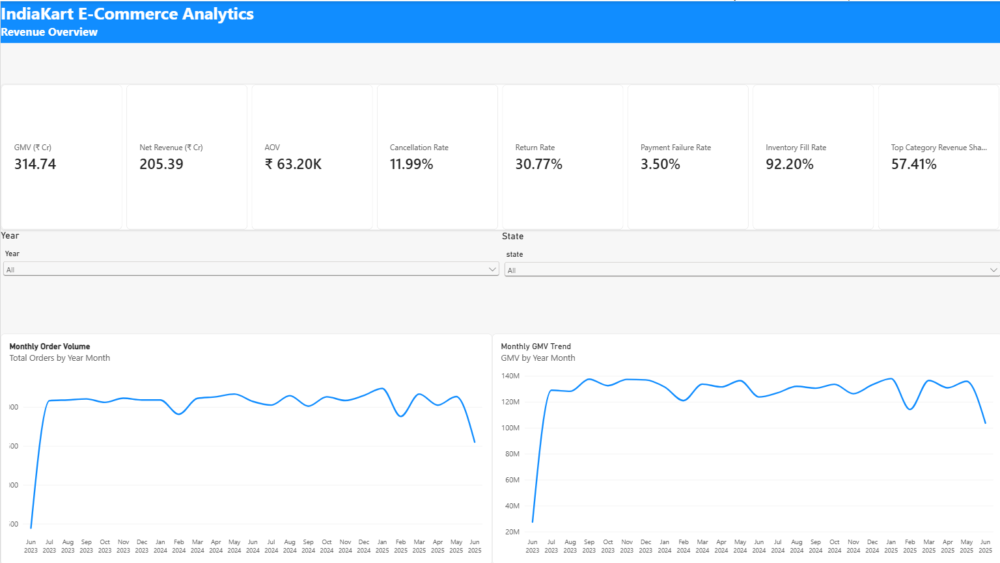
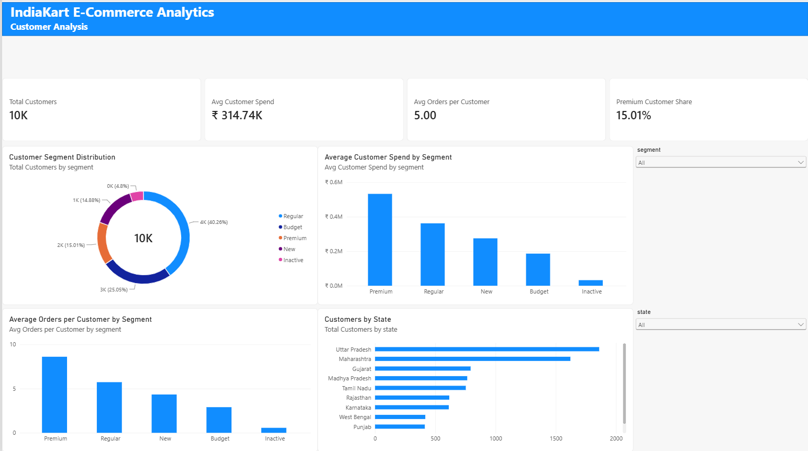
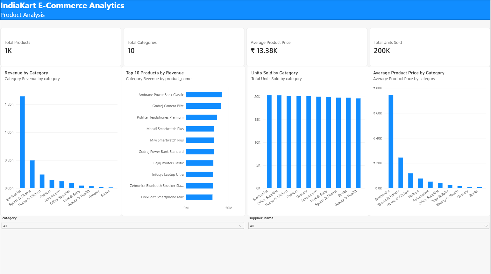
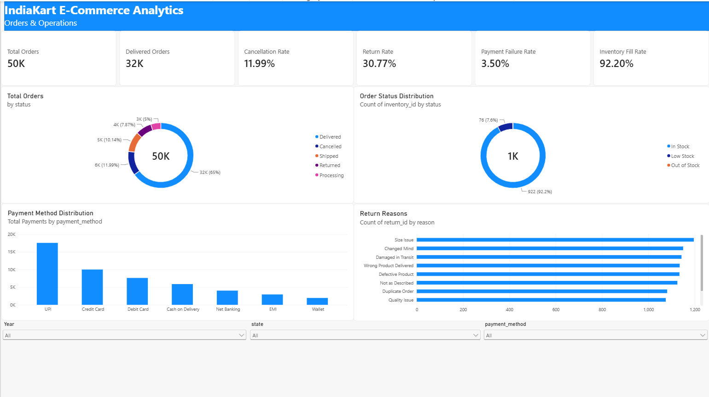
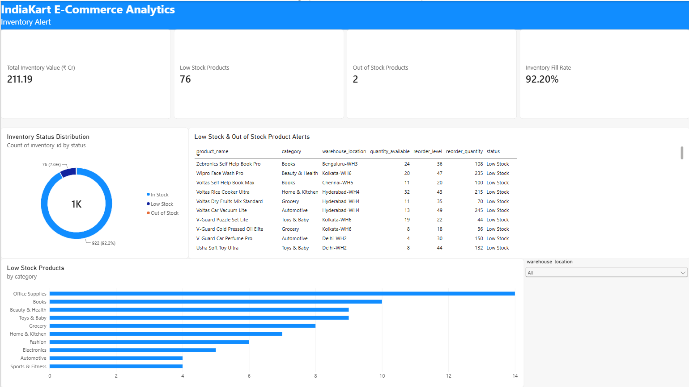

# 🛒 IndiaKart E-Commerce Analytics

A complete end-to-end E-Commerce Data Analytics project built using **Python, Pandas, SQL concepts, and Power BI**.

The project analyzes customer behavior, revenue performance, product performance, order operations, payments, returns, and inventory to provide management-level business insights.

---

## 📊 Project Overview

IndiaKart is a simulated e-commerce business dataset containing multiple interconnected tables.

The objective of this project was to:

- Clean and explore the data
- Build a relational data model
- Create business KPIs using DAX
- Build interactive Power BI dashboards
- Analyze customers, products, orders, payments, returns, and inventory
- Provide management recommendations based on the analysis

---

## 🗂️ Dataset

The project contains 8 main datasets:

| Dataset | Records |
|---|---:|
| Customers | 10,000 |
| Inventory | 1,000 |
| Order Items | 100,000 |
| Orders | 50,000 |
| Payments | 50,000 |
| Products | 1,000 |
| Returns | 10,000 |
| Suppliers | 200 |

Duplicate-row checks were performed across all datasets and no duplicate records were found.

---

## 🛠️ Tools & Technologies

- Python
- Pandas
- NumPy
- Jupyter Notebook
- SQL
- Power BI
- DAX
- Microsoft Excel
- Git & GitHub

---

## 📈 Key Business KPIs

| KPI | Result |
|---|---:|
| GMV | ₹314.74 Cr |
| Net Revenue | ₹205.39 Cr |
| Average Order Value | ₹63.20K |
| Total Orders | 50K |
| Delivered Orders | 32K |
| Total Customers | 10K |
| Cancellation Rate | 11.99% |
| Return Rate | 30.77% |
| Payment Failure Rate | 3.50% |
| Inventory Fill Rate | 92.20% |
| Top Category Revenue Share | 57.41% |
| Total Products | 1K |
| Product Categories | 10 |
| Total Units Sold | 200K |
| Inventory Value | ₹211.19 Cr |
| Low Stock Products | 76 |
| Out of Stock Products | 2 |

---

## 📊 Power BI Dashboard

The Power BI dashboard contains **5 interactive pages**.

### 1. Revenue Overview

Tracks revenue performance, AOV, cancellation rate, return rate, inventory availability, and monthly sales trends.



### 2. Customer Analysis

Analyzes customer segmentation, average spend, purchase frequency, premium customers, and geographic distribution.



### 3. Product Analysis

Analyzes revenue by category, top products, units sold, average product price, and supplier/category performance.



### 4. Orders & Operations

Analyzes order status, payment methods, return reasons, delivery performance, and inventory status.



### 5. Inventory Alert

Tracks inventory availability, low-stock products, out-of-stock products, warehouses, reorder quantities, and replenishment alerts.



---

## 💡 Key Insights

- IndiaKart generated **₹314.74 Cr GMV** and approximately **₹205.39 Cr Net Revenue**.
- The top product category contributes approximately **57.41% of category revenue**.
- Premium customers show higher average spending and purchase frequency.
- Approximately **32K of 50K orders** were successfully delivered.
- The cancellation rate is approximately **11.99%**.
- The return rate is relatively high at approximately **30.77%**.
- UPI is one of the most heavily used payment methods.
- Inventory availability is strong with a **92.20% fill rate**.
- **76 products are Low Stock** and **2 products are Out of Stock**.
- Electronics is a major contributor to overall product revenue.

---

## 🎯 Business Recommendations

Management should focus on reducing product returns and order cancellations, maintaining stock availability for high-revenue products, improving supplier and fulfillment performance, targeting Premium and Regular customers with personalized campaigns, and reducing dependency on a single dominant product category.

Inventory replenishment should prioritize products based on sales velocity, revenue importance, warehouse location, and reorder quantity.

---

## 📁 Repository Structure

```text
IndiaKart_Ecommerce_Analytics/
│
├── dashboard/
│   ├── IndiaKart_Phase4_Dashboard_Hemanth.pbix
│   └── IndiaKart_Ecommerce_Analytics_Dashboard.pdf
│
├── data/
│
├── notebooks/
│
├── reports/
│   └── IndiaKart_Management_Report_Hemanth.docx
│
├── screenshots/
│   ├── 01_Revenue_Overview.png
│   ├── 02_Customer_Analysis.png
│   ├── 03_Product_Analysis.png
│   ├── 04_Orders_Operations.png
│   └── 05_Inventory_Alert.png
│
└── README.md